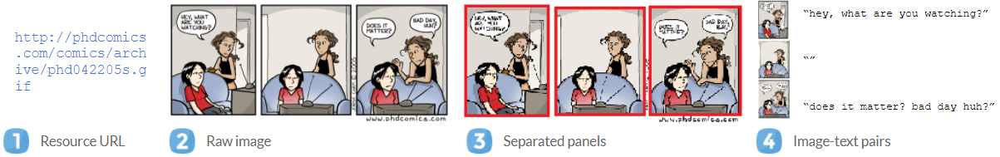
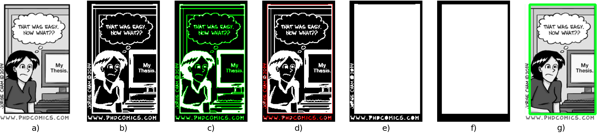
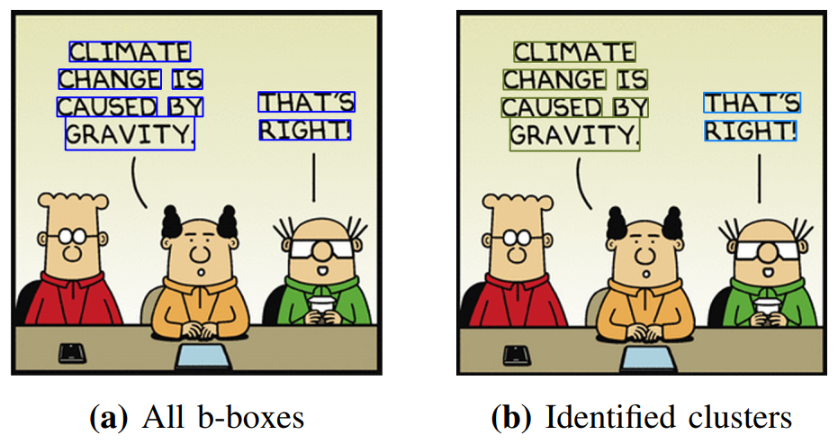

# Automated Comic Dataset Construction Pipeline

### Context
[This repository](https://github.com/mstyczen/comic-dcp) contains the source code for my Bachelor's thesis on the topic of "Automated Comic Dataset Construction Pipeline".
The thesis research was conducted for the CSE3000 Research Project course in summer semester of 2021, completing my BSc Computer Science and Engineering at TU Delft, Netherlands.

The motivation and background for the project, as well as the detailed explanation of the methodology behind the proposed solution and
extensive evaluation of the pipeline is available in the research paper delivered for the project, see [TU Delft Repository](TODO).

I would like to thank my supervisors, prof. Lydia Chen and dr. Zilong Zhao, for the help I received throughout the whole process of working on the thesis.

### Goal of the system
Comic illustrations and transcriptions form an attractive dataset for several problems, including computer vision tasks, such as recognizing character's faces, generating new comics, or natural language processing tasks like automated comic translation or detecting emotion in the dialogues. However, despite a large number of comic strips published online, only a few datasets of annotated comic illustrations are available. This forms a bottleneck for further advancements in the field. The source of the data scarcity is the manual labor required for annotation - one has to download the comic strips, separate each strip into panels (individual illustrations), and transcribe the text.

See the process in the image below:

(comic strip from Piled Higher and Deeper by Jorge Cham, phdcomics.com)

The goal of this project was to develop a tool that can perform the whole dataset creation process automatically.

### System design
The system is designed as a pipeline consisting of three components:
 1. web scraping
 2. panel extraction
 3. text extraction
 
Please see an overview below:


### Implementation & usage
#### Web scraper
The web scraper implementation is provided in the `Scraper.py` file in the `scraper` package. The scraper is implemented using `Python`'s `requests` and `BeautifulSoup` packages.

The key methods are:
* `scrape_images`, given a list of image urls, scrapes them from the web and returns the array representations of the images.
* `scrape_images_multithreaded`: behaves the same as `scrape_images`, but uses parallelization to improve efficiency. Takes an additional parameter, `max_workers`, limiting the number of threads.
* `scrape_and_save_multithreaded`: behaves the same as `scrape_images_multithreaded`, but instead of returning the images as a list, it saves them to a specified directory

#### Panel extractor
The `PanelExtractor.py` file in the `panel_extraction` package provides an implementation of the panel extraction algorithm.
The algorithm uses a frame detection pipeline to establish the locations of the panels, see the figure below:
 
 (comic strip from Piled Higher and Deeper by Jorge Cham, phdcomics.com)

The key method of `PanelExtractor` is:
* `extract_and_save_panels`: Given a list of image urls, it reads the images, extracts panels and saves them to disk. It takes two additional parameters: 
    * `threshold_type` (`constant`/`adaptive`), determining the type of threshold used for binarization
    * `iterations`, determining the number of morphology opening iterations used for denoising the image

#### Text extractor
The text extractor implementation is provided in the `text_extractor` package, and consists of the following classes:
* `OCRPreprocessor`: responsible for pre-processing the OCR, contains two methods: `rescale_for_ocr` and `binarize_for_ocr`.
* `OCRPostprocessor`: performs post processing of the OCR results:
    * `cluster` method performs output correction using bounding box clustering, see image below
    * `autocorrect` method uses dictionary-based correction to correct errors in the OCR output
* `TesseractOCR`: uses the [Tesseract] OCR engine to extract text from an image
* `VisionOCR`: uses Google's [Cloud Vision API] OCR to extract text from an image
* `TextExtractor` contains the `extract_text` method, that given the list of imgs paths, performs the OCR text extraction using the specified engine, preprocessing and post-processing steps.

 
  (comic strip from Dilbert by Scott Adams, dilbert.com)
 
#### Example usage of the full pipeline
##### Prerequisites
You need to install Tesseract on your machine to be able to use the system, please follow the instructions from this page: https://tesseract-ocr.github.io/tessdoc/
If you want to use Google Cloud Vision API, you need to provide the Google cloud credentials (https://cloud.google.com/vision/docs/setup) in a `.json` file in the `credentials` directory.
After you do those, please update the following constants in the `text_extractor/TextExtractor.py` file with the appropraite paths:
```python
tesseract_path = r'C:\Program Files\Tesseract-OCR\tesseract.exe'
cloud_credentials = '../../credentials/credentials.json'
```

An example of using a full pipeline to construct data points for annotated Dilbert dataset are presented in the `pipeline.py` file in the `pipeline` package.
 
First, the comic image URLs are established for the first 10 comics of 2021.
```python
start_date = datetime.datetime(2021, 1, 1, 0, 0)
end_date = datetime.datetime(2021, 1, 11, 0, 0)
dates = get_dates_list(start_date, end_date)
date_strings = [str(date.strftime('%Y-%m-%d')) for date in dates]
comic_urls = [f"http://dilbert.com/strip/{date_string}" for date_string in date_strings]
```

Then, `Scraper` is used to retrieve asset URLs, download all the images, and save them to disk:
```python
scraper = Scraper()
# get asset url from the main page
urls = scraper.get_asset_urls_multithreaded(comic_urls)
# determing output paths, scrape images and save them
full_images_directory = "../../data/full-images"
full_images_paths = [f"{full_images_directory}/{date}.png" for date in date_strings]
scraper.scrape_and_save_multithreaded(urls, full_images_paths, max_workers=5)
```

Next, the `PanelExtractor` is used to divide the comics into individual panels and save those to a desired directory:
```python
# extract panels from each full illustration
panel_extractor = PanelExtractor()
splitted_images_directory = "../../data/splitted-images"
splitted_images_paths = panel_extractor.extract_and_save_panels(full_images_paths, splitted_images_directory)
```

Finally, the `TextExtractor` is used to extract the text. In this case, Vision API is used for the OCR. The resizing and clustering steps are applied, but the binarization and autocorrect steps are skipped.
```python
# get transcriptions
transcriptions = extract_text(splitted_images_paths, "vision-api", rescale=True, clustering=True)
```

Lastly, the resulting of the image-text pairs are visualized:
```python
for path in splitted_images_paths:
    image = cv2.imread(path)
    cv2.imshow("path", image)
    print(transcriptions[path])
    cv2.waitKey(0)
```

#### Notes
Please note that most comic strips published online are copyrighted and scraping them, especially with the goal of distributing them online,
is forbidden. Therefore, before you use this software for any purpose, please read the *Terms and Conditions* of the comic page you want to scrape.